# Outputs

A visual walkthrough of the Student API's journey from a running FastAPI service to a fully GitOps-delivered, secrets-managed, observed, and alerted-on production-style stack.

## Table of Contents

- [1. The API](#1-the-api)
- [2. CI/CD on a Self-Hosted Runner](#2-cicd-on-a-self-hosted-runner)
- [3. GitOps Delivery with ArgoCD](#3-gitops-delivery-with-argocd)
- [4. Secrets Management with Vault](#4-secrets-management-with-vault)
- [5. The Observability Stack](#5-the-observability-stack)
- [6. Alerting: Prometheus → Alertmanager → Slack](#6-alerting-prometheus--alertmanager--slack)

---

## 1. The API

The starting point: a Student CRUD REST API built with FastAPI, versioned under `/api/v1`, with liveness/readiness probes and full Swagger docs. Everything downstream — CI/CD, GitOps, secrets, observability, alerting — exists to build, deploy, secure, and watch this service.

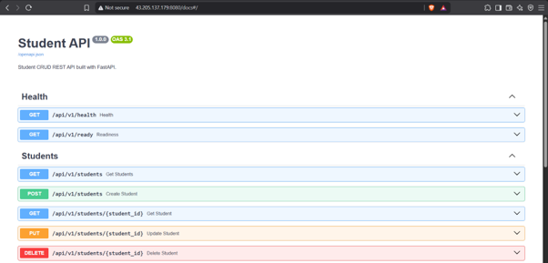

## 2. CI/CD on a Self-Hosted Runner

Rather than relying on GitHub-hosted runners, the pipeline runs on a self-hosted EC2 runner registered directly with the repo. This gives the CI/CD pipeline (Gitleaks → Semgrep → build/test/lint → Docker build/scan/push → GitOps bump) a stable, controllable environment closer to how a real infra team would run CI against private/internal resources.

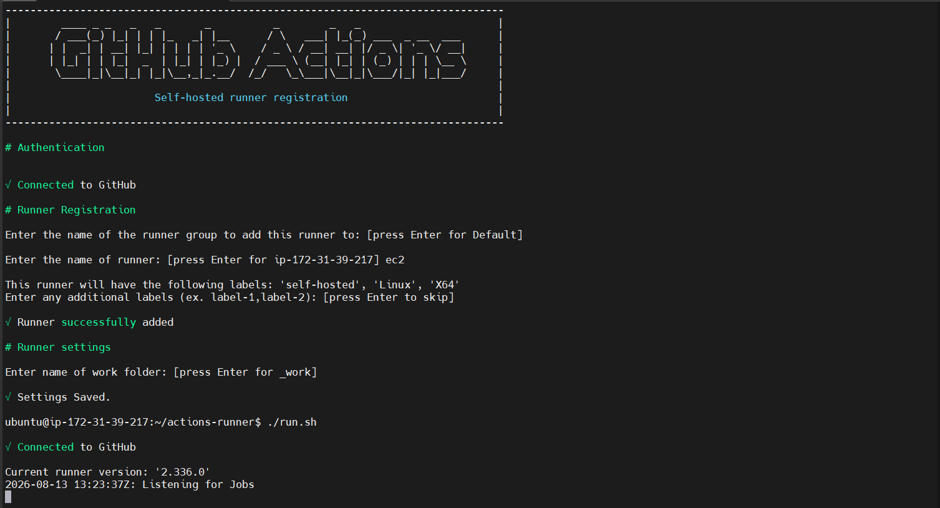

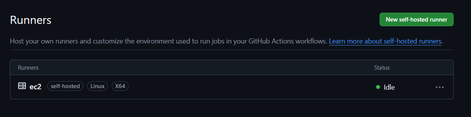

## 3. GitOps Delivery with ArgoCD

Once CI bumps the image tag in git, ArgoCD takes over. It continuously reconciles the cluster against what's committed to `main` — no one runs `kubectl apply` or `helm install` by hand after bootstrap. Two `ApplicationSet`s generate all the Applications: one for infrastructure (Vault, External Secrets Operator), one for the full observability stack, alongside the `student-api` app itself.

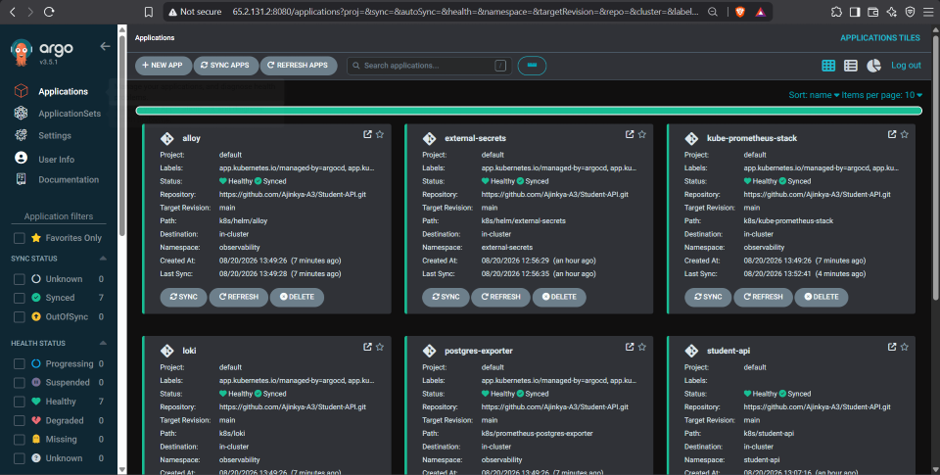

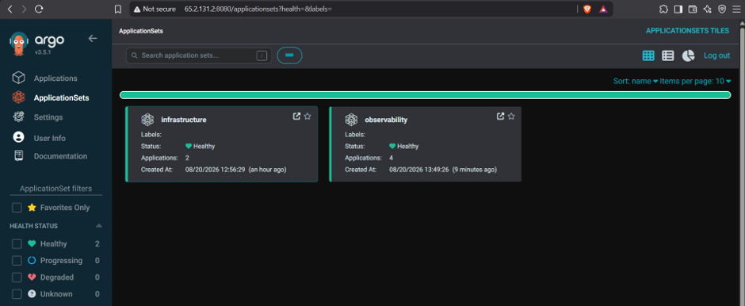

## 4. Secrets Management with Vault

Database credentials and other secrets live in Vault's KV v2 engine rather than being hardcoded or committed to git. External Secrets Operator syncs them into the cluster as native Kubernetes `Secret`s, closing the gap left by the compose-file's plaintext dev credentials.

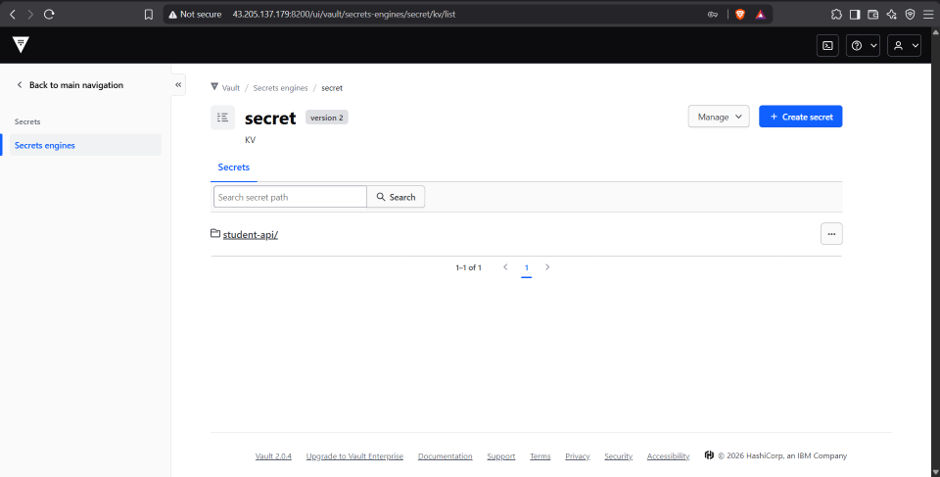

## 5. The Observability Stack

The full PLG stack (Prometheus, Loki, Grafana + Alloy) plus purpose-built exporters gives visibility into every layer: the cluster itself, the database, external HTTP health, and application logs — all provisioned as code and organized under one Grafana folder.

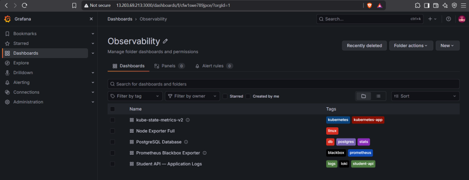

Cluster-wide resource usage and node health, sourced from kube-state-metrics:

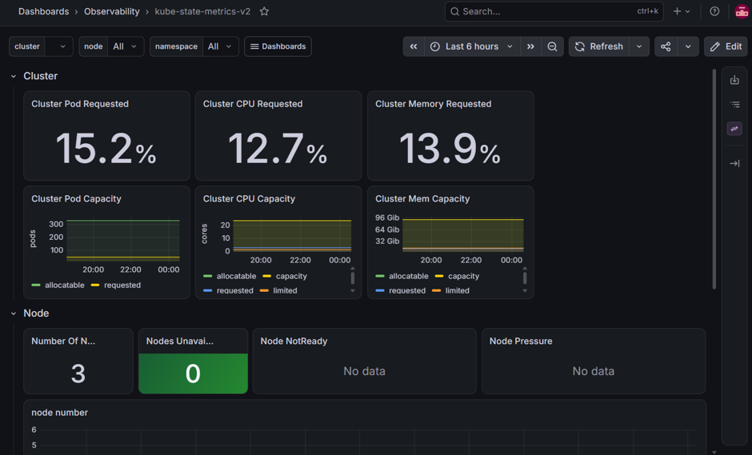

Postgres-exporter feeding a dedicated database dashboard — connections, CPU/memory, file descriptors, and engine settings:

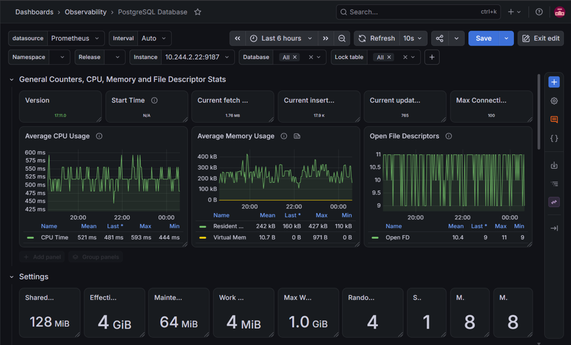

Blackbox exporter probing external HTTP endpoints (ArgoCD, the API's own health check) for uptime and latency:

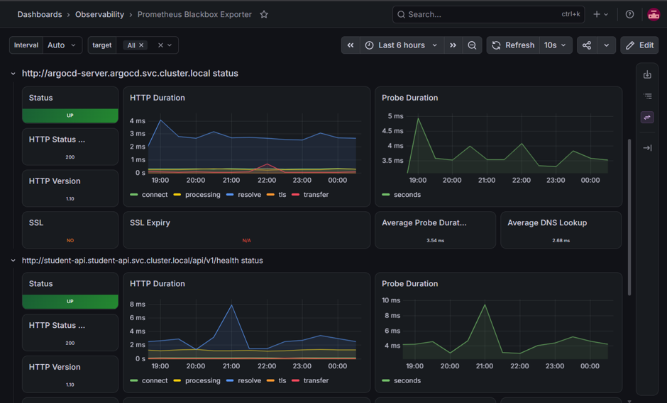

Structured JSON application logs shipped via Alloy into Loki, with log volume and error-rate panels:

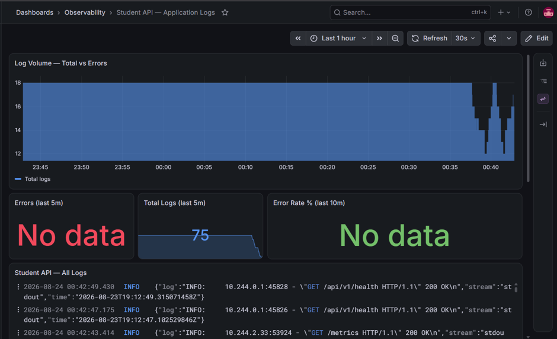

## 6. Alerting: Prometheus → Alertmanager → Slack

The last piece closes the loop from a broken metric to a human getting paged. Prometheus evaluates both built-in and custom alerting rules (error rate, latency percentiles, request volume spikes), Alertmanager groups and routes them, and Slack delivers the final notification.

Alert rules defined and evaluated in Prometheus:

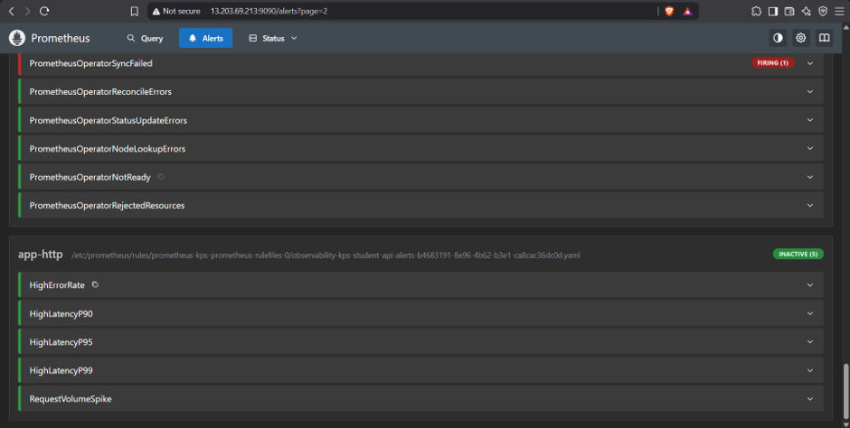

Active alerts grouped and routed in Alertmanager:

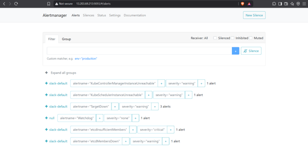

Alerts landing in the team's Slack channel, including a critical Postgres pod restart:

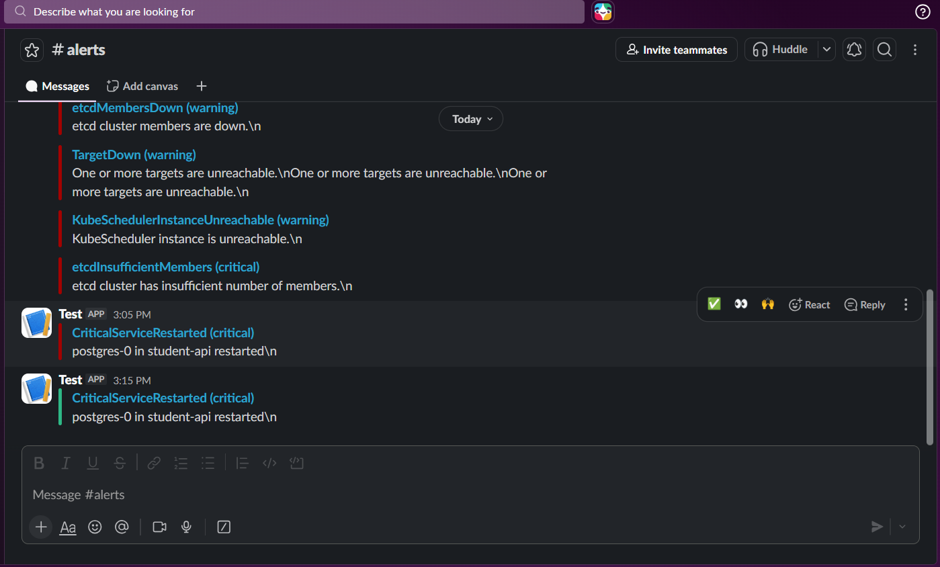